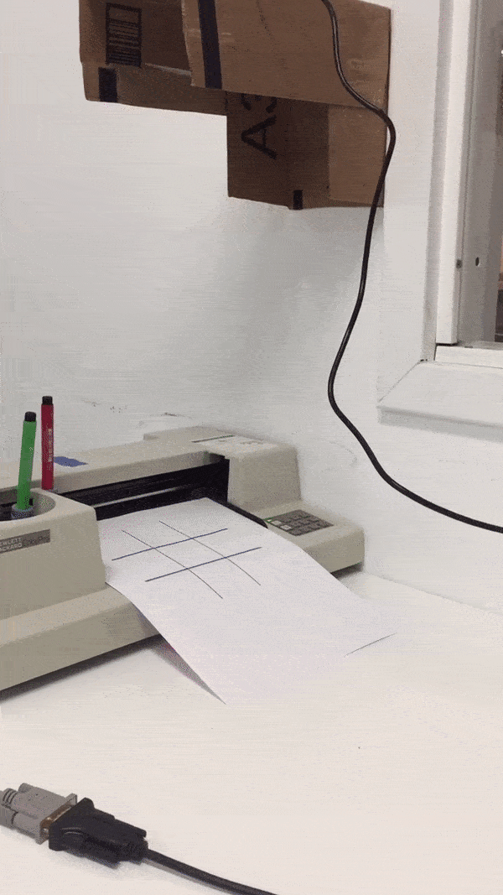

## Human vs. Plotter Tic-Tac-Toe

@johnvtan and I used a Playstation eye and 1980's HP pen-plotter to create a new kind of user interface:

We used the C++ binding for OpenCV for image-processing, and implemented our game-logic in Lua (using the [minimax decision algorithm](https://en.wikipedia.org/wiki/Minimax#Minimax_algorithm_with_alternate_moves)). The plotter interfaces with our program over a serial connection, and takes drawing instructions in an antiquated plotter language called [HPGL](https://en.wikipedia.org/wiki/HP-GL).